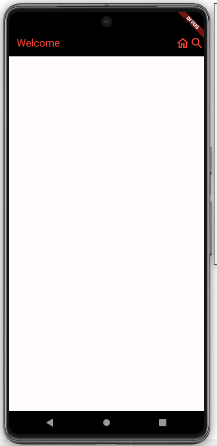
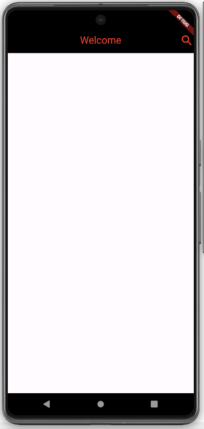
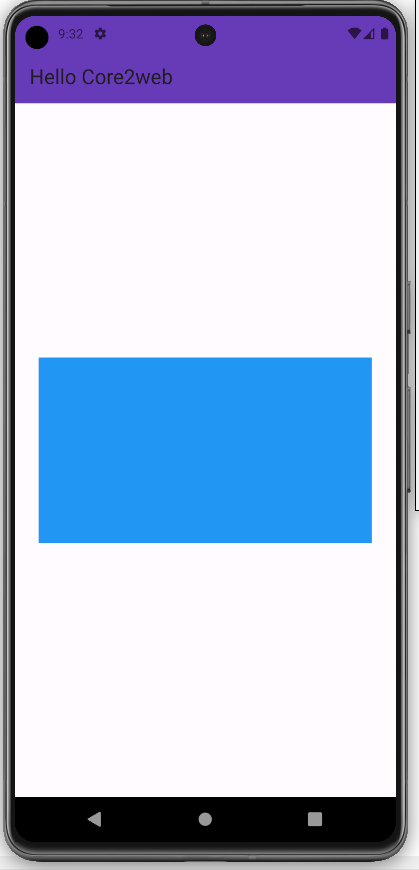
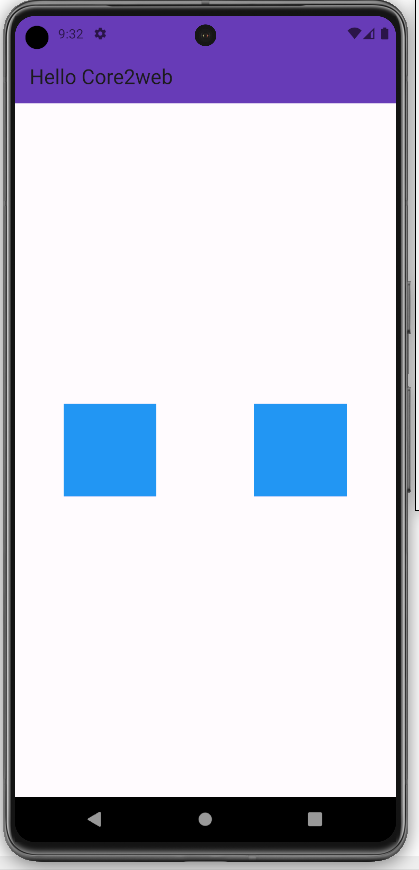
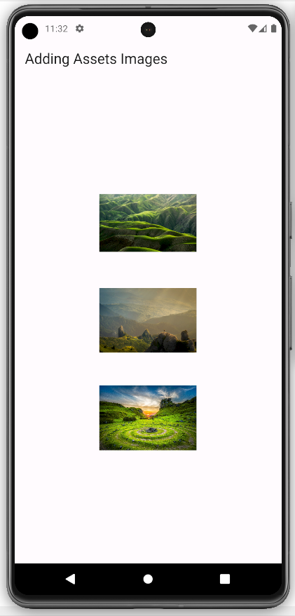
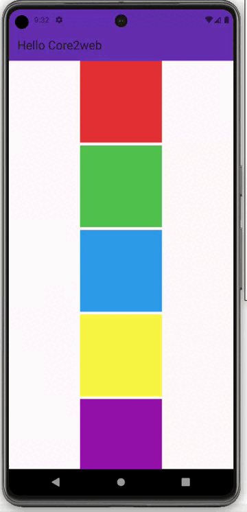
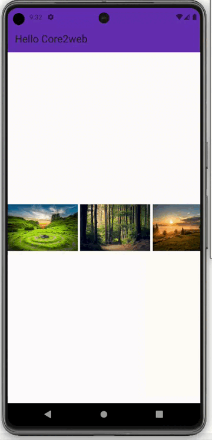
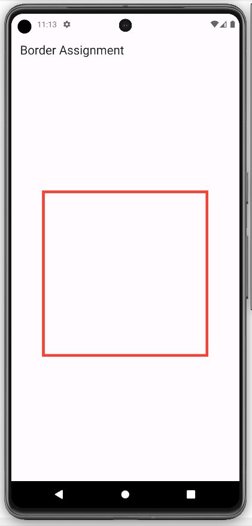
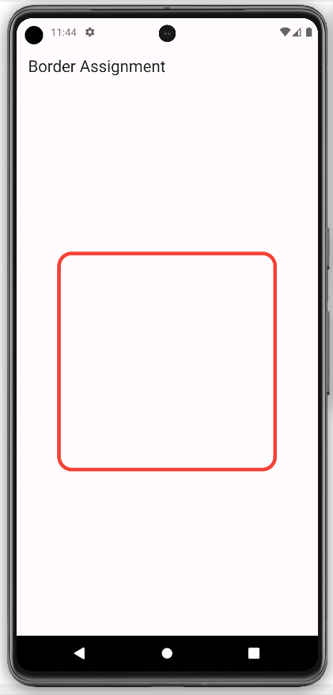
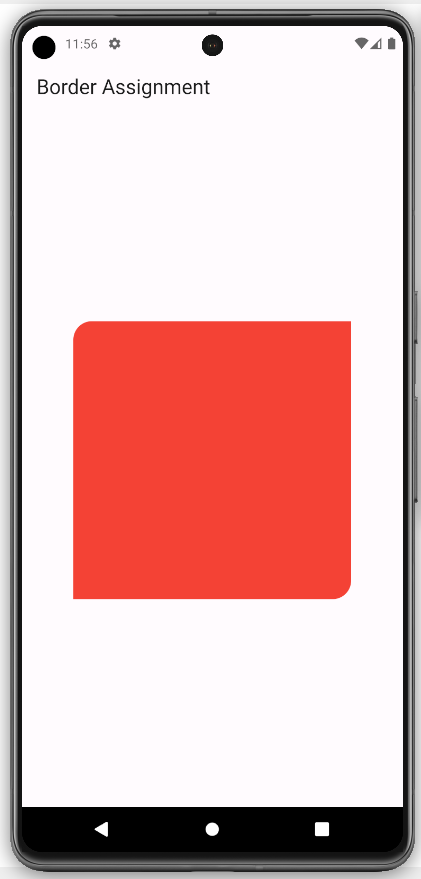

# Assignment 10

## AppBar and Container

### preview 

1. Create an AppBar, add a title and add any 2 icons at the end of the appbar and give color to the AppBar.

 
 
 
 

2. Create an AppBar, give an Icon at the end of the app bar, and give a title in the middle of the appbar.

 
 
 
 

3. Create a screen with a deep purple app bar titled "Hello Core2web" and in the
centre of the body create a blue container with (width: 360, height: 200).

 
 
 
 

4. Create 2 containers in the centre of the screen and give that color to the containers.

 
 
 
 

5. In the screen, show 3 asset images of size (width: 150, height: 150).

 
 
  

6. Create a screen in which add 10 colourful containers vertically and make the screen scrollable.

 
 
 
 

7. Create a screen in which add 5 network images horizontally with size (width: 150, height: 300) and make scrollable.

 
 
 
 

8. In the screen, add a container with size (width: 300,height:300). Also, add a border to that Container, the border must be of color red.

 
 
 
 

9. In the screen, add a container with size (width: 300,height:300) and add a border to that Container, the border must be of color red. Also, add rounded corners to the container with a radius 20.

 
 
 
 

10. In the screen, add a container with size (width: 300,height:300). Give colour to the container. Make container’s top-left and bottom-right corners rounded with radius 20.

